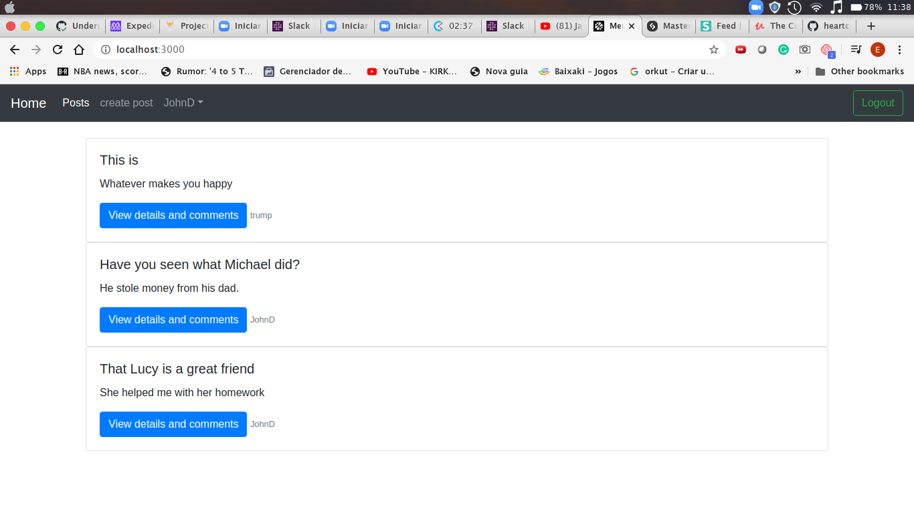

# Members Only

## Description

    We made a small forum where Logged in users can post about whatever they want , comment other posts. Not logged in can only read the posts, but not comment neither see the authors.

- Screenshot with logged in user
  
- Screenshot with without logged in user
  

## Built With

- Ruby on Rails
- Vs Code
- Bootstrap

## Live Demo

[Live Demo Link](https://radiant-anchorage-05112.herokuapp.com/)

## Getting Started

To get a local copy up and running follow these simple example steps.

### Prerequisites

- Ruby on Rails

### Usage

- Clone the project to your local machine
- Open your terminal and type in 'rails db:migrate'
- Type 'rails server' on your terminal

## Author

- Okiror Frank
- Expedito Andrade

👤 **Okiror Frank**

- Github: [@frankopkusianwar](https://github.com/frankopkusianwar)
- Twitter: [@franko0781](https://twitter.com/franko0781)
- Linkedin: [Okiror Frank](https://linkedin.com/in/frank-okiror-250076b5)
- Email: okirorfrank3@gmail.com

👤 **Expedito Andrade**

- Github: [@githubexpjazz](https://github.com/expjazz)
- Twitter: [@expjazz](https://twitter.com/expeditoandrade13)
- Linkedin: [Expedito Andrade](https://www.linkedin.com/in/expedito-andrade-3645151a4/)
- Email: expeditojazz@gmail.com

## 🤝 Contributing

Contributions, issues and feature requests are welcome!

Feel free to check the [issues page](issues/).

## Show your support

Give a ⭐️ if you like this project!

## Acknowledgments

- Microverse, standup team and the microverse community for helping build the skills that were used on this project

## 📝 License

This project is [MIT](lic.url) licensed.
